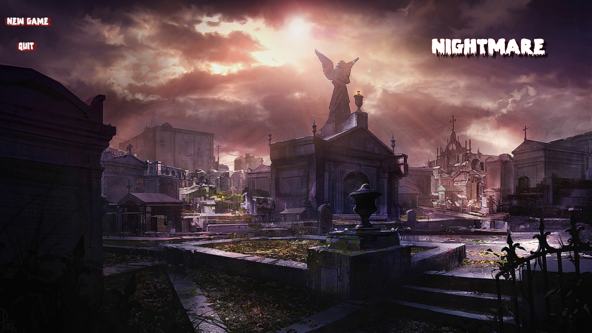
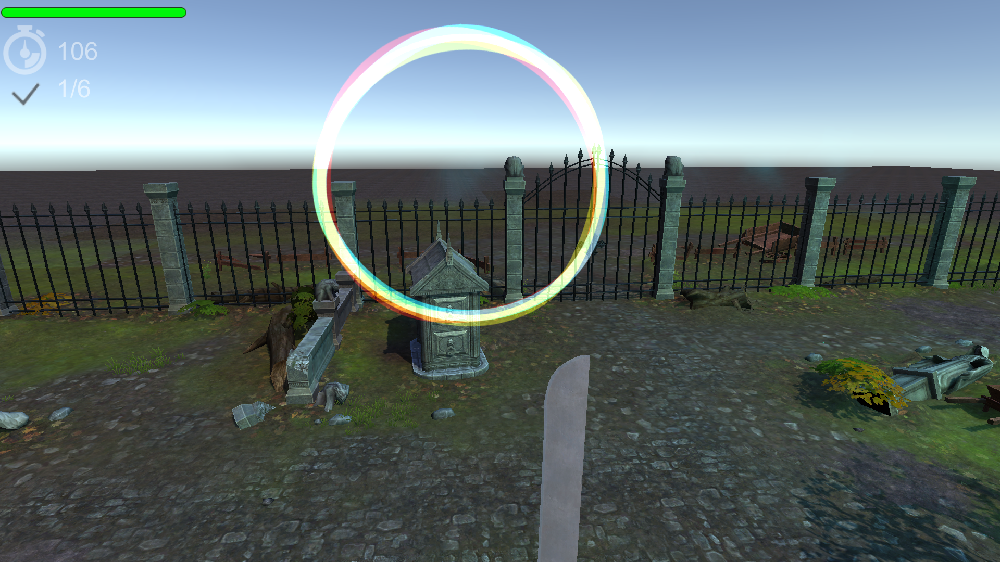
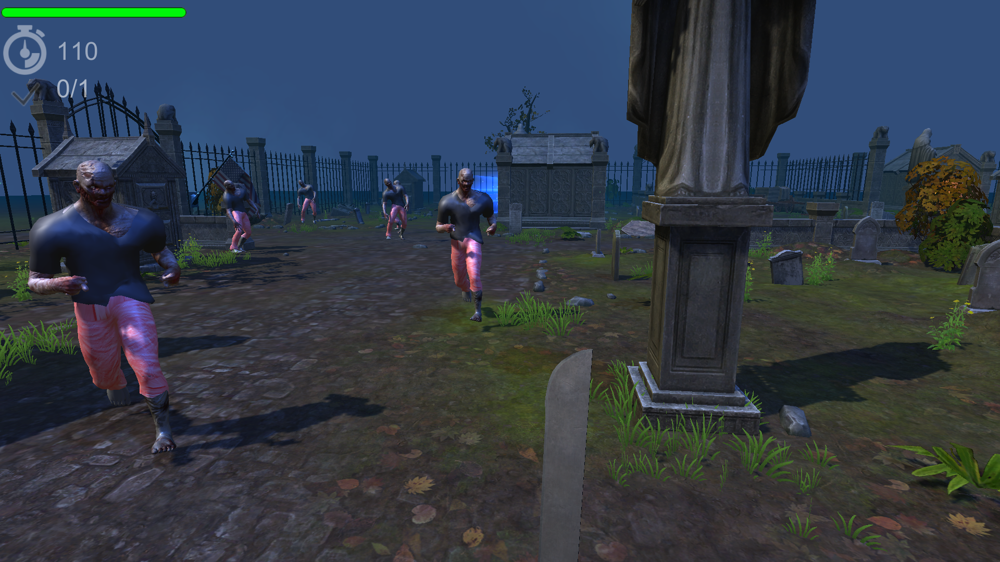

GDD – Nightmare
High Concept
You found yourself in an abandoned cemetery.
You need to escape, but first there is couple of quests you need to do.

List of levels

Level 1 – solve the cemetery mystery.
You found an old letter with a riddle.. solve it to get on.
Game over: time is over.
Level complete: hit the lighting tomb and the statue that facing the exit gate.

Level 2 – the old gravestones
If you wish to get out, you need to destroy the undead graves.
Game over: time is over.
Level complete: hit ten gravestone.

Level 3 – parkour
They are coming. How fast can you run?
Game over: time is over.
Level complete: pass through all checkpoints.

Level 4 – they are awake
The zombies are here, and all you want is to get home.	
Game over: time is over or catched by one of the zombies.
Level complete: get to the US flag.

Level 5 – its now or never
If you want to escape, you need to fight.
Game over: time is over or killed by the zombies.
Level complete: kill the zombies and escape the cemetery.

